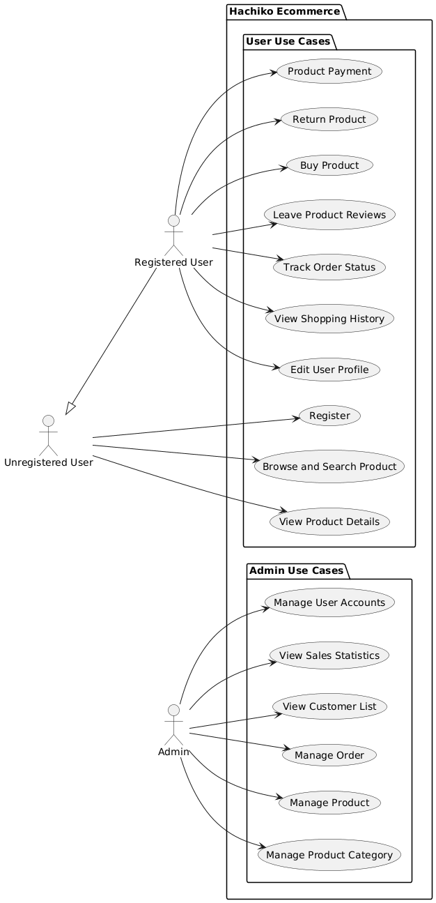
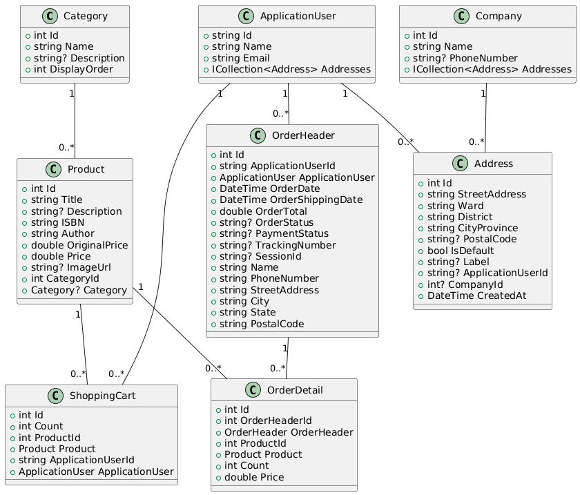

# Hachiko - E-Commerce Web Application

An ASP.NET Core 10 MVC e-commerce application implementing a book store with clean architecture, Identity authentication, and Stripe payment integration.

## Technologies

- **ASP.NET Core 10** (MVC pattern)
- **Entity Framework Core** with SQL Server
- **ASP.NET Core Identity** with Facebook & Google OAuth
- **Stripe** payment processing
- **Repository & Unit of Work** patterns

## How to Get Started
Read the document below
- [Getting Started Guide](https://longhuynhdev.github.io/Hachiko/articles/getting-started.html)

## Documentation

Full documentation is available at: **https://longhuynhdev.github.io/Hachiko/**

## Use-case Diagram

## Class Diagram
