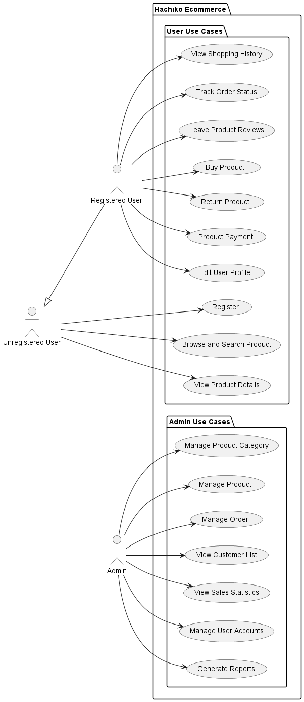

# EC-Project


## Use-case diagram


## Project Setup Guide

### 1. Database Setup

#### Using Docker for SQL Server
```bash
docker run -e "ACCEPT_EULA=Y" -e "MSSQL_SA_PASSWORD=SQLServer123@" \
-p 1433:1433 --name sqlserver -d \
mcr.microsoft.com/mssql/server:2022-latest
```

#### Create Database
1. Connect to SQL Server using your preferred tool (SSMS, DBeaver, etc.)
   - Server: `localhost`
   - Username: `sa`
   - Password: `SQLServer123@`
2. Create new database named `Hachiko`

### 2. Application Setup

1. Clone the repository
```bash
git clone [repository-url]
cd Hachiko\Hachiko
```
2. Update Database Schema
- Make sure Entity Framework Core tools are installed:
```bash
dotnet tool install --global dotnet-ef
```
- Make sure you are in the Hachiko project folder
- Then run this command:
```bash
dotnet ef database update
```


### 3. Connection String
Verify the connection string in `appsettings.json`:
```json
"ConnectionStrings": {
    "DefaultConnection": "Server=localhost;Database=Hachiko;User Id=sa;Password=SQLServer123@; TrustServerCertificate=True;"
}
```

### 4. Run the Application
```bash
dotnet run
```

### Troubleshooting
- Ensure Docker is running before starting SQL Server container
- Verify SQL Server is accessible on port 1433


