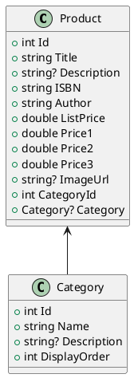

## Class Diagram

```plantuml
@startuml

class Product {
    +int Id
    +string Title
    +string? Description
    +string ISBN
    +string Author
    +double ListPrice
    +double Price1
    +double Price2
    +double Price3
    +string? ImageUrl
    +int CategoryId
    +Category? Category
}

class Category {
    +int Id
    +string Name
    +string? Description
    +int DisplayOrder
}

Product <-- Category

@enduml
```
