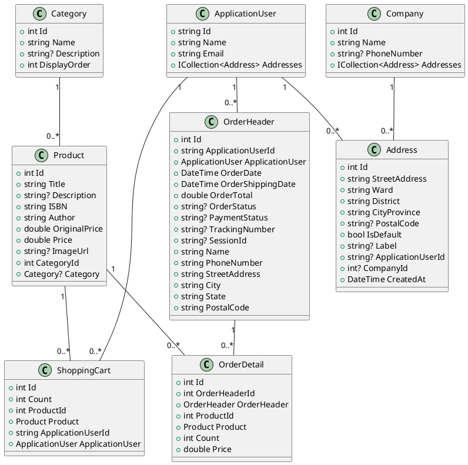

## Class Diagram

```plantuml
@startuml

class Category {
    +int Id
    +string Name
    +string? Description
    +int DisplayOrder
}

class Product {
    +int Id
    +string Title
    +string? Description
    +string ISBN
    +string Author
    +double OriginalPrice
    +double Price
    +string? ImageUrl
    +int CategoryId
    +Category? Category
}

class ApplicationUser {
    +string Id
    +string Name
    +string Email
    +ICollection<Address> Addresses
}

class Company {
    +int Id
    +string Name
    +string? PhoneNumber
    +ICollection<Address> Addresses
}

class Address {
    +int Id
    +string StreetAddress
    +string Ward
    +string District
    +string CityProvince
    +string? PostalCode
    +bool IsDefault
    +string? Label
    +string? ApplicationUserId
    +int? CompanyId
    +DateTime CreatedAt
}

class ShoppingCart {
    +int Id
    +int Count
    +int ProductId
    +Product Product
    +string ApplicationUserId
    +ApplicationUser ApplicationUser
}

class OrderHeader {
    +int Id
    +string ApplicationUserId
    +ApplicationUser ApplicationUser
    +DateTime OrderDate
    +DateTime OrderShippingDate
    +double OrderTotal
    +string? OrderStatus
    +string? PaymentStatus
    +string? TrackingNumber
    +string? SessionId
    +string Name
    +string PhoneNumber
    +string StreetAddress
    +string City
    +string State
    +string PostalCode
}

class OrderDetail {
    +int Id
    +int OrderHeaderId
    +OrderHeader OrderHeader
    +int ProductId
    +Product Product
    +int Count
    +double Price
}

Category "1" -- "0..*" Product
ApplicationUser "1" -- "0..*" Address
Company "1" -- "0..*" Address
ApplicationUser "1" -- "0..*" ShoppingCart
Product "1" -- "0..*" ShoppingCart
ApplicationUser "1" -- "0..*" OrderHeader
OrderHeader "1" -- "0..*" OrderDetail
Product "1" -- "0..*" OrderDetail

@enduml
```
