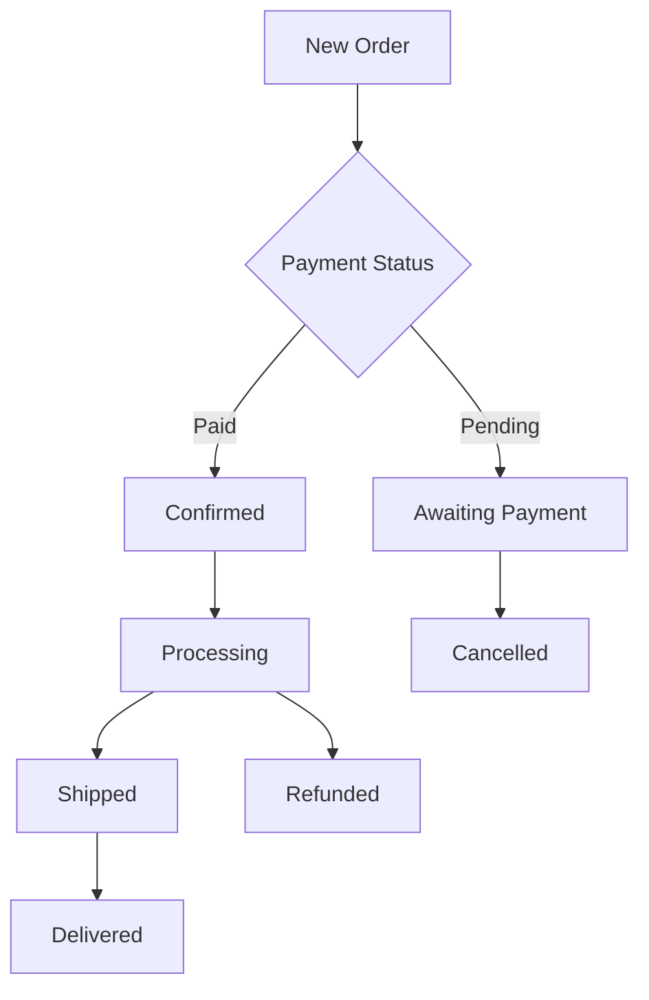

## Order Processing Workflow

```mermaid
graph TD
    A[New Order] --> B{Payment Status}
    B -->|Paid| C[Confirmed]
    B -->|Pending| D[Awaiting Payment]
    C --> E[Processing]
    E --> F[Shipped]
    F --> G[Delivered]
    D --> H[Cancelled]
    E --> I[Refunded]
```